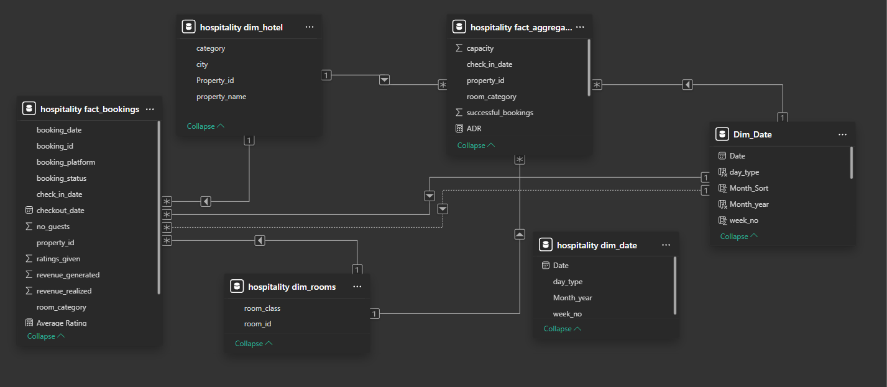
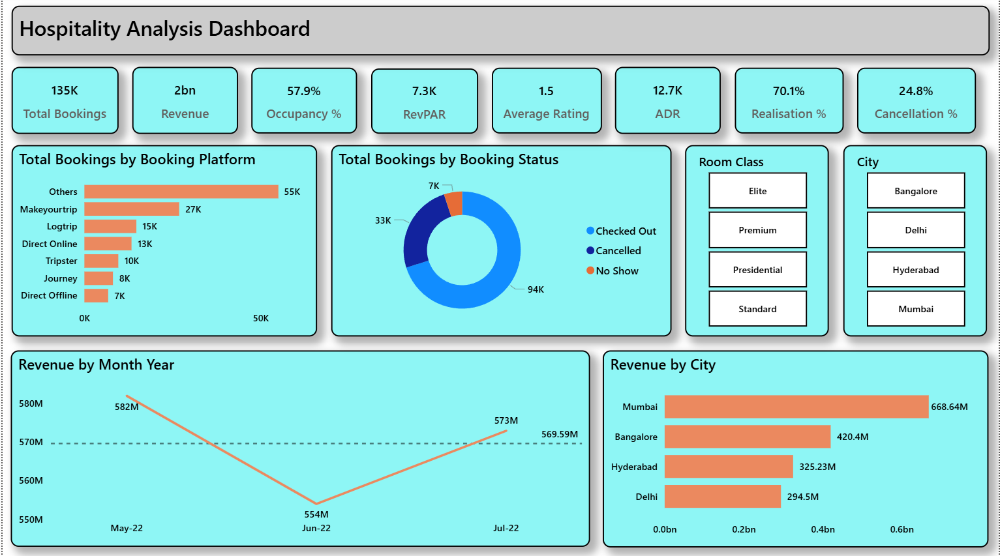

# Hospitality Analytics Dashboard

An interactive Power BI dashboard analyzing hotel bookings and revenue performance across multiple cities, built on a star-schema data model.

## Overview

This project analyzes hotel booking and revenue data to help stakeholders track performance across cities, room categories, and booking platforms. The dashboard uses a star-schema model linking fact and dimension tables for efficient, scalable reporting.

## Tools Used

- **Power BI** — Data modeling, DAX measures, interactive dashboard design
- **SQL** — Data cleaning and table consolidation
- **Excel** — Initial data exploration and validation

## Data Model



The model follows a star-schema design with two fact tables and four dimension tables:

**Fact Tables:**
- `hospitality fact_bookings` — booking-level grain, with booking date, platform, status, guests, ratings, and revenue fields
- `hospitality fact_aggregated_bookings` — aggregated grain with capacity, successful bookings, and ADR

**Dimension Tables:**
- `hospitality dim_hotel` — property category, city, property ID/name
- `hospitality dim_rooms` — room class and room ID
- `hospitality dim_date` / `Dim_Date` — date, day type, month/year, week number
- `Dim_Date` — full calendar table with day type, month sort, month-year, and week number, used for time intelligence

## Dashboard Preview



## Key Metrics

| Metric | Value |
|---|---|
| Total Bookings | 135K |
| Total Revenue | ₹2bn+ |
| Occupancy % | 57.9% |
| RevPAR | 7.3K |
| ADR (Average Daily Rate) | 12.7K |
| Average Rating | 1.5 |
| Realisation % | 70.1% |
| Cancellation % | 24.8% |

## Key Features

- Star-schema data model linking fact and dimension tables for efficient, scalable reporting
- KPI cards tracking Total Bookings, Revenue, Occupancy %, RevPAR, ADR, Average Rating, Realisation %, and Cancellation %
- Booking breakdown by platform (Others, MakeYourTrip, Logtrip, Direct Online, Tripster, Journey, Direct Offline)
- Booking status breakdown (Checked Out, Cancelled, No Show)
- Room class filters (Elite, Premium, Presidential, Standard)
- City-level filters and revenue comparison (Bangalore, Delhi, Hyderabad, Mumbai)
- Monthly revenue trend line to track performance over time
- Weekday/Weekend classification for date-based analysis
- Designed for fast, self-serve reporting — no manual pulls needed for common stakeholder questions

## Key DAX Measures

```dax
Revenue = SUM('hospitality fact_bookings'[revenue_realized])

ADR = DIVIDE([Revenue], [Total Bookings], 0)

Occupancy % = DIVIDE([Total Succesful Bookings], [Total Capacity], 0)

RevPAR = DIVIDE([Revenue], [Total Capacity])

Cancellation % = DIVIDE([Total cancelled bookings], [Total Bookings])

Realisation % = 1 - ([Cancellation %] + [No Show rate %])

day_type = 
IF(
    WEEKDAY(Dim_Date[Date], 2) >= 6,
    "Weekend",
    "Weekday"
)
```

## Files

- `hospitality_project.pbix` — full Power BI report file
- `Dashboard-Overview.png` — dashboard preview image
- `Data-Model.png` — star-schema data model diagram

---

**Author:** Ritesh Singh | [LinkedIn](https://linkedin.com/in/ritesh-singh-26dec)
